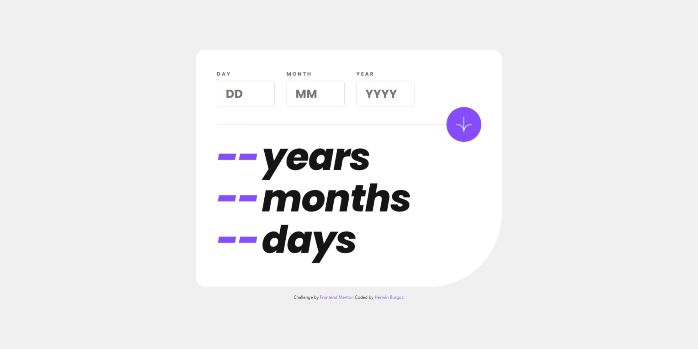

# Frontend Mentor - Age calculator app solution

This is my solution to the [Age calculator app challenge on Frontend Mentor](https://www.frontendmentor.io/challenges/age-calculator-app-dF9DFFpj-Q). Frontend Mentor challenges help you improve your coding skills by building realistic projects. 

## Table of contents

- [Overview](#overview)
  - [The challenge](#the-challenge)
  - [Screenshot](#screenshot)
  - [Links](#links)
- [My process](#my-process)
  - [Built with](#built-with)
  - [What I learned](#what-i-learned)
- [Author](#author)

## Overview

### The challenge

Users should be able to:

- View an age in years, months, and days after submitting a valid date through the form
- Receive validation errors if:
  - Any field is empty when the form is submitted
  - The day number is not between 1-31
  - The month number is not between 1-12
  - The year is in the future
  - The date is invalid e.g. 31/04/1991 (there are 30 days in April)
- View the optimal layout for the interface depending on their device's screen size
- See hover and focus states for all interactive elements on the page
- **Bonus**: See the age numbers animate to their final number when the form is submitted

### Screenshot

### Links

- Solution URL: [GitHub Repository](https://github.com/burgosha/age-calculator-app)
- Live Site URL: [Click here](https://bha-age-calculator-app.netlify.app/)

## My process

### Built with

- Semantic HTML5 markup
- CSS custom properties
- Flexbox
- Mobile-first workflow
- [React](https://reactjs.org/) - JS library
- [React-Spring](https://www.react-spring.dev/) - React Library

### What I learned

At this time, this is one of the most time-consuming research projects for me.
I have had to become familiar with methods such as Date(), getFullYear(), getMonth() and getDate(), and their implementation in hooks.
Error handling has also taken me quite some time. The code could be better, but I prioritize the logic in it and decide to leave it as it is.

## Author

- Website - [Hernán Burgos](https://github.com/burgosha)
- Frontend Mentor - [@burgosha](https://www.frontendmentor.io/profile/burgosha)

